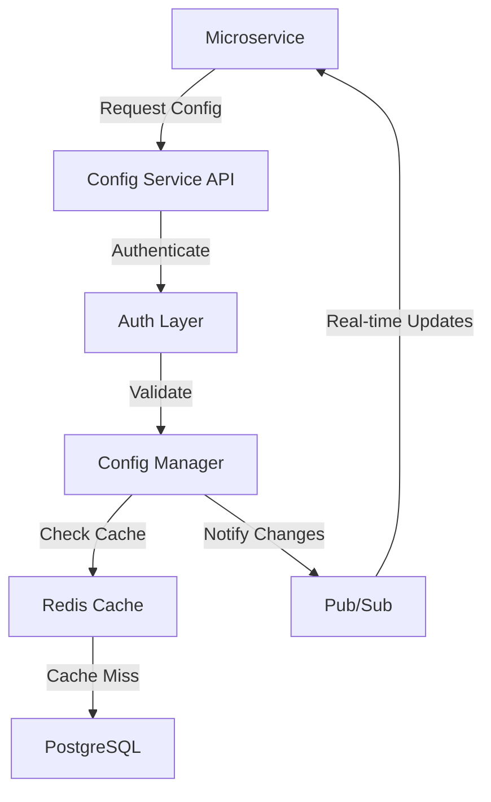

# Shared Configuration Service Architecture

## Overview

A centralized configuration management service to handle shared configuration data across microservices in the Security Monitoring Suite.

## Architecture Design

### 1. Core Components

#### Configuration Service

- **Type**: REST API Service
- **Language**: Go
- **Primary Database**: PostgreSQL (for persistent storage)
- **Cache Layer**: Redis (for fast access and pub/sub)
- **Authentication**: JWT + API Key based
- **Deployment**: Kubernetes

### 2. Key Features

#### 2.1 Configuration Management

- Secure storage of sensitive data
- Version control of configurations
- Configuration validation
- Real-time updates via pub/sub
- Access control and audit logging

#### 2.2 Data Categories

- API Keys
- Tenant IDs
- Service Endpoints
- Kafka Configuration
- Database Credentials
- Environment-specific settings

#### 2.3 Security Features

- Encryption at rest
- TLS for data in transit
- Role-based access control
- Audit logging
- API key rotation

### 3. Integration Points

#### 3.1 Service Integration

- REST API endpoints for CRUD operations
- WebSocket for real-time updates
- SDK libraries for Go and TypeScript

#### 3.2 Kubernetes Integration

- ConfigMap and Secret management
- Sidecar pattern for configuration updates
- Service discovery integration

### 4. High-Level Flow

### 5. Data Storage Design

#### 5.1 PostgreSQL Schema

- Configuration tables with versioning
- API key management
- Audit logging
- Access control tables

#### 5.2 Redis Caching

- Configuration data caching
- Pub/sub for real-time updates
- Cache invalidation strategy
- TTL-based cache management

### 6. Security Considerations

#### 6.1 Authentication & Authorization

- JWT-based authentication
- API key validation
- Role-based access control
- Rate limiting

#### 6.2 Data Protection

- Encryption at rest using AES-256
- TLS 1.3 for data in transit
- Secure key rotation
- Regular security audits

### 7. Scalability & Performance

#### 7.1 Performance Targets

- Response time < 100ms
- 99.9% availability
- Support for 1000+ req/sec

#### 7.2 Scaling Strategy

- Horizontal scaling
- PostgreSQL replication
- Redis cache cluster
- Load balancing

#### 7.3 Caching Strategy

- Write-through caching
- Cache invalidation on updates
- Configurable TTL
- Cache warming for critical configs

### 8. Monitoring & Maintenance

#### 8.1 Monitoring

- Prometheus metrics
- Grafana dashboards
- Alert rules
- Performance monitoring
- Cache hit ratio tracking

#### 8.2 Maintenance

- Automated backups (PostgreSQL)
- Version control
- Rollback capabilities
- Audit trails
- Cache management

## Implementation Phases

### Phase 1: Core Service

1. Basic CRUD operations with PostgreSQL
2. Authentication & Authorization
3. Redis caching integration
4. API documentation

### Phase 2: Advanced Features

1. Real-time updates with Redis pub/sub
2. SDK development
3. Monitoring setup
4. Security hardening

### Phase 3: Integration

1. Service integration
2. Kubernetes operators
3. CI/CD pipeline
4. Documentation & training

### Phase 4: Performance Optimization

1. Cache tuning
2. Query optimization
3. Performance testing
4. Scalability verification
