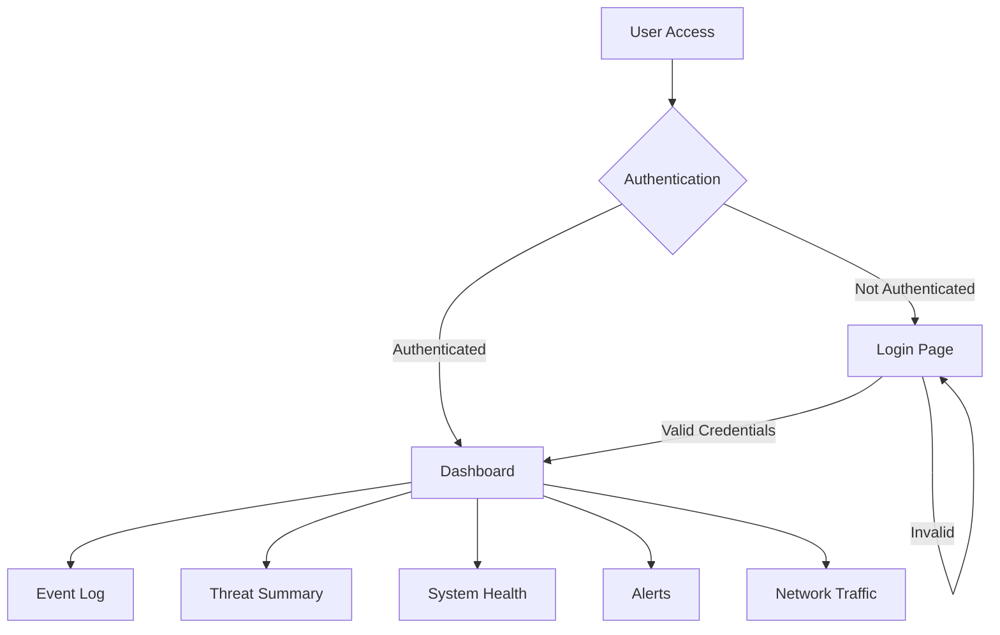
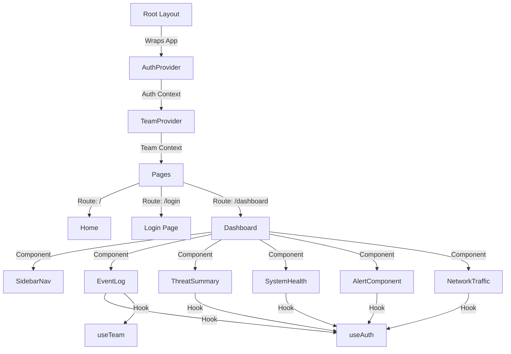

# SIEM Dashboard

A modern Security Information and Event Management (SIEM) dashboard built with Next.js 14, featuring real-time monitoring, threat detection, and system health tracking capabilities.

## Table of Contents

- [Overview](#overview)
- [Application Structure](#application-structure)
- [Key Features](#key-features)
- [Getting Started](#getting-started)
- [Application Flow](#application-flow)
- [Detailed Component Flow](#detailed-component-flow)
- [Components](#components)
- [Authentication & Authorization](#authentication--authorization)
- [Development](#development)

## Overview

The SIEM Dashboard is a comprehensive security monitoring solution that provides real-time visibility into system events, threats, and network traffic. Built with Next.js 14, it leverages the App Router architecture for efficient routing and server-side rendering capabilities.

## Application Structure

```
siem-dashboard/
├── app/                    # Main application directory (Next.js 14 App Router)
│   ├── api/               # API route handlers
│   ├── components/        # Shared UI components
│   ├── contexts/          # React Context providers
│   ├── hooks/            # Custom React hooks
│   ├── services/         # Service layer for API interactions
│   └── [routes]/         # Application routes/pages
├── public/               # Static assets
└── styles/              # Global styles and CSS modules
```

## Key Features

- **Real-time Event Monitoring**: Track and analyze security events as they occur
- **Threat Detection**: Advanced threat detection and analysis capabilities
- **System Health Monitoring**: Monitor the health and performance of your systems
- **Alert Management**: Comprehensive alert handling and notification system
- **Network Traffic Analysis**: Real-time network traffic monitoring and analysis
- **Team-based Access Control**: Multi-team support with role-based access control
- **Responsive Design**: Fully responsive interface built with Tailwind CSS

## Getting Started

1. **Prerequisites**

   - Node.js 18 or later
   - npm or yarn package manager

2. **Installation**

   ```bash
   # Clone the repository
   git clone [repository-url]

   # Install dependencies
   npm install

   # Set up environment variables
   cp .env.example .env.local
   ```

3. **Development**

   ```bash
   # Start development server
   npm run dev

   # Build for production
   npm run build

   # Start production server
   npm run start
   ```

## Application Flow



## Detailed Component Flow



## Components

### Core Components

- **EventLog**: Displays real-time security events and logs
- **ThreatSummary**: Overview of current security threats and risks
- **SystemHealth**: System performance and health metrics
- **AlertComponent**: Real-time alert management and display
- **NetworkTraffic**: Network traffic analysis and visualization

### Context Providers

- **AuthProvider**: Manages authentication state
- **TeamProvider**: Handles team-based access and permissions

### Custom Hooks

- **useAuth**: Authentication state management
- **useTeam**: Team context and operations
- **useRequest**: API request handling

## Authentication & Authorization

The application uses a comprehensive authentication system:

- JWT-based authentication
- Role-based access control
- Team-based permissions
- Secure session management

## Development

### Key Technologies

- **Next.js 14**: React framework with App Router
- **TypeScript**: Type-safe development
- **Tailwind CSS**: Utility-first CSS framework
- **Radix UI**: Accessible component primitives
- **React Hook Form**: Form handling
- **Axios**: HTTP client
- **Zod**: Schema validation

### Best Practices

- Use TypeScript for type safety
- Follow the component-based architecture
- Implement proper error handling
- Write clean, maintainable code
- Document new features and changes

### Environment Variables

```
NEXT_PUBLIC_API_URL=your_api_url
NEXT_PUBLIC_AUTH_URL=your_auth_url
```

### Contributing

1. Create a feature branch
2. Make your changes
3. Submit a pull request
4. Ensure CI/CD checks pass (lol none yet)
