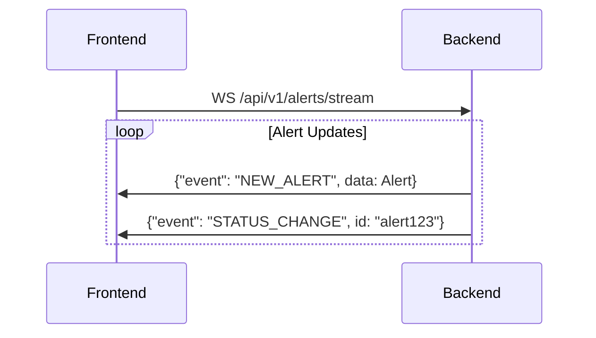

# SIEM Dashboard UI Integration Tasks

## Event Log Enhancements

- [ ] Add severity level indicators

  - Implement severity enum (Critical, High, Medium, Low)
  - Create severity badges component
  - Add severity column to event log table
  - Update event log data structure to include severity

- [ ] Implement event correlation

  - Add correlation ID field to events
  - Create linked events view component
  - Implement event relationship visualization
  - Add API endpoint for fetching related events

- [ ] Enhanced filtering system

  - Create filter component for common event types
  - Implement saved filters functionality
  - Add time range selector
  - Create custom filter builder

- [ ] Contextual information
  - Add user context to event details
  - Implement entity information cards
  - Create asset lookup integration
  - Add user activity timeline

## Threat Summary Improvements

- [ ] Trend Analysis

  - Implement trend calculation logic
  - Create trend indicator component
  - Add historical comparison data
  - Implement trend graphs

- [ ] Threat Intelligence Integration

  - Add threat feed status indicators
  - Create threat intel source manager
  - Implement IOC matching display
  - Add threat confidence scoring

- [ ] Geographic Threat Mapping

  - Implement geo-mapping component
  - Add location data processing
  - Create interactive threat map
  - Add geographic filtering

- [ ] MITRE ATT&CK Integration
  - Create MITRE technique mapping
  - Implement tactics visualization
  - Add technique details modal
  - Create MITRE matrix view

## System Health Monitoring

- [ ] Resource Metrics

  - Implement resource usage graphs
  - Create threshold alerting
  - Add historical usage trends
  - Implement resource forecasting

- [ ] Agent/Sensor Management

  - Create agent status dashboard
  - Implement agent health checks
  - Add agent configuration view
  - Create agent troubleshooting guide

- [ ] Data Management
  - Add ingestion rate monitoring
  - Implement retention policy manager
  - Create storage usage alerts
  - Add data source health checks

## Network Traffic Analysis

- [ ] Traffic Visualization

  - Implement protocol distribution charts
  - Create top talkers dashboard
  - Add traffic flow diagrams
  - Implement bandwidth usage graphs

- [ ] Anomaly Detection Display
  - Create anomaly indicator component
  - Implement baseline deviation alerts
  - Add anomaly investigation view
  - Create anomaly correlation display

## New Component Integration

- [ ] Compliance Dashboard

  - Create compliance status overview
  - Implement control mapping
  - Add compliance report generator
  - Create audit trail viewer

- [ ] Identity Monitoring

  - Implement AD integration display
  - Create user activity dashboard
  - Add privilege analysis view
  - Implement identity risk scoring

- [ ] Asset Management

  - Create asset inventory dashboard
  - Implement asset classification
  - Add vulnerability status integration
  - Create asset relationship map

- [ ] SOC Metrics Dashboard
  - Implement MTTD/MTTR tracking
  - Create analyst performance metrics
  - Add SLA compliance monitoring
  - Implement case management metrics

## Backend Integration Requirements

- [ ] API Endpoints

  - Create event aggregation endpoints
  - Implement threat intel API
  - Add metric collection endpoints
  - Create correlation API

- [ ] Data Processing

  - Implement event enrichment
  - Create threat scoring system
  - Add anomaly detection processing
  - Implement data normalization

- [ ] Performance Optimization
  - Implement data caching
  - Add query optimization
  - Create data aggregation jobs
  - Implement lazy loading

## Documentation

- [ ] Technical Documentation

  - Create API documentation
  - Add component usage guides
  - Document data structures
  - Create integration guides

- [ ] User Documentation
  - Create feature guides
  - Add troubleshooting documentation
  - Create configuration guides
  - Add best practices documentation

## Testing

- [ ] Unit Tests

  - Create component test suite
  - Implement API tests
  - Add data processing tests
  - Create utility function tests

- [ ] Integration Tests
  - Implement end-to-end tests
  - Create performance tests
  - Add load testing suite
  - Implement security tests

## System Metrics Dashboard

See [METRICS_DASHBOARD_TASKS.md](./METRICS_DASHBOARD_TASKS.md) for detailed implementation tasks.

- [ ] Phase 1: Core Integration

  - Set up metrics data pipeline
  - Implement basic metrics display
  - Create real-time updates system

- [ ] Phase 2: Advanced Features

  - Add detailed process monitoring
  - Implement host management
  - Create advanced visualizations

- [ ] Phase 3: Optimization
  - Performance improvements
  - UI/UX refinements
  - Documentation and testing

## Deployment

- [ ] CI/CD Pipeline
  - Create build automation
  - Implement automated testing
  - Add deployment automation
  - Create rollback procedures

Priority levels should be assigned based on:

1. Critical security features
2. Core functionality improvements
3. User experience enhancements
4. Nice-to-have features

Each task should be assigned to a sprint based on dependencies and resource availability.

# Backend-Frontend Integration Tasks

## 1. API Contract Implementation

```typescript
// Generated from backend's domain/alert.go
export interface Alert {
  id: string;
  title: string;
  description: string;
  severity: "LOW" | "MEDIUM" | "HIGH" | "CRITICAL";
  status: "OPEN" | "RESOLVED" | "IGNORED";
  source: string;
  createdAt: string; // ISO 8601
  relatedLogs: string[];
}

// services/alertService.ts
export const fetchAlerts = async (params: {
  timeRange?: [Date, Date];
  severity?: Alert["severity"];
  page?: number;
}) => {
  // Implementation using axios
};
```

## 2. Real-Time Integration



## 3. Critical Performance Paths

- Batch API requests using backend's batch endpoints
- Cache configuration matching backend TTL:

```yaml
# log-aggregator/config.yaml
cache:
  ttl: 2m
  time_range_ttl: 1m
```

## 4. Security Implementation

```typescript
// contexts/AuthContext.tsx
const API_KEY_STORAGE_KEY = "log_aggregator_api_key";

export const useAuth = () => {
  const [apiKey, setApiKey] = useState<string | null>(
    localStorage.getItem(API_KEY_STORAGE_KEY)
  );

  // Add key to all requests
  axios.interceptors.request.use((config) => ({
    ...config,
    headers: {
      ...config.headers,
      "X-API-Key": apiKey,
    },
  }));
};
```

## 5. Integration Test Plan

```gherkin
Feature: Alert Streaming
  Scenario: Receive real-time alert
    Given the backend has new alerts
    When I connect to the alert stream
    Then I should receive alert updates within 500ms
```

## 6. Developer Task Breakdown

1. **API Service Implementation** - 8h

   - Location: `siem-dashboard/app/services/alertService.ts`
   - Depends on: Backend API docs

2. **WebSocket Integration** - 6h

   - Location: `siem-dashboard/hooks/useAlertStream.ts`
   - Test with: `log-aggregator/internal/handler/alert_handler.go`

3. **Security Context** - 4h
   - Add to: `siem-dashboard/app/contexts/AuthContext.tsx`
   - Validate with: `log-aggregator/internal/middleware/auth.go`

| Task             | Est. Hours | Owner          | Status  |
| ---------------- | ---------- | -------------- | ------- |
| API Base Service | 8          | Frontend Team  | Pending |
| Alert Streaming  | 6          | Fullstack Team | Pending |
| Cache Sync       | 3          | Backend Team   | Pending |
