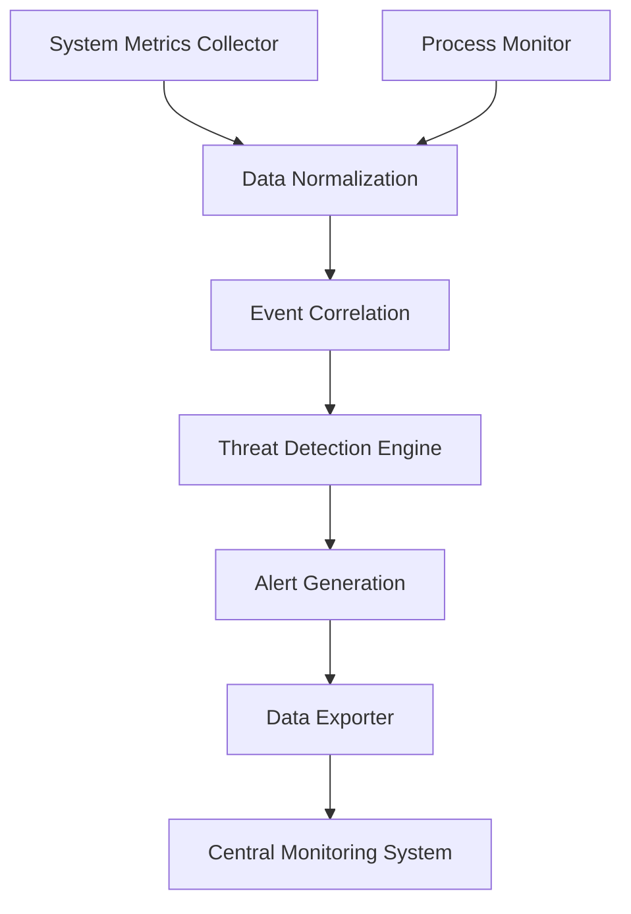

# System Monitoring Agent Architecture

## Overview

The System Monitoring Agent is a lightweight, cross-platform agent designed to collect system metrics, monitor processes, and detect potential security threats. It operates as a background service, collecting and transmitting data to the central monitoring system.

## Key Components

### Data Collection Layer

- **System Metrics Collector**: Gathers CPU, memory, disk, and network metrics
- **Process Monitor**: Tracks running processes and resource usage
- **Threat Detection Engine**: Analyzes system behavior for potential threats

### Processing Layer

- **Data Normalization**: Standardizes collected metrics
- **Event Correlation**: Links related system events
- **Alert Generation**: Creates alerts based on configured thresholds

### Communication Layer

- **Data Exporter**: Sends collected data to central monitoring
- **Configuration Receiver**: Handles remote configuration updates
- **Heartbeat Monitor**: Maintains connection with central system

## Data Flow

1. System metrics and process data collected
2. Data normalized and analyzed
3. Threat detection rules applied
4. Processed data transmitted to central system
5. Alerts generated and sent when thresholds exceeded

## Component Interactions

## Security Considerations

- All data transmission encrypted using TLS
- Configuration updates require authentication
- Agent runs with minimal required privileges
- Regular security updates applied automatically
